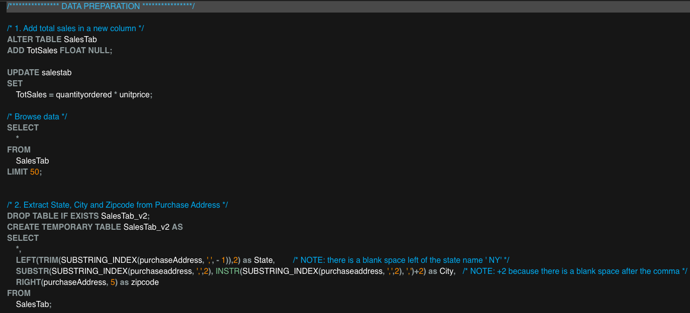
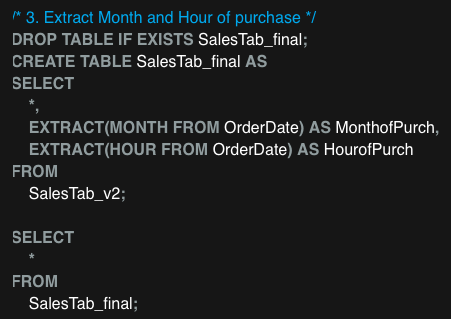
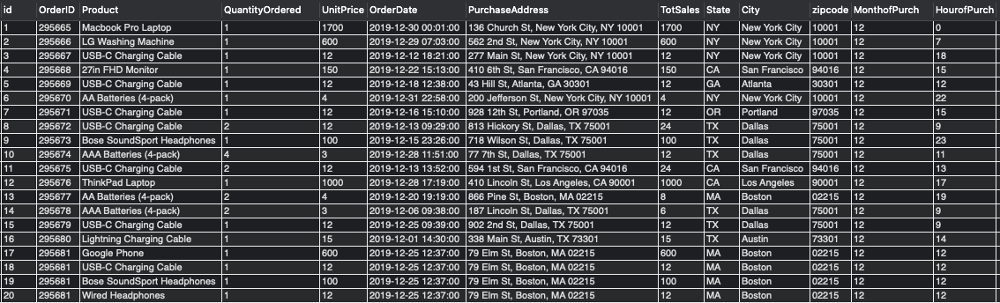

## Goal 

The analysis of sales data aim to answer to the following questions from management in order to efficiently plan the advertisement campaign for 2020: 

   1. What is the best month for sales? What is the total revenue in the highest selling month?
   2. What is the best day of the month for sales? Is there an increase in sales after payday, i.e. after the 25th of the month?
   3. What time should we diplay advertisements to maximize the likelihood of customers buying product? 
   4. What cities sold the most product? What is their total yearly revenue? 
   5. What is the average monthly number of orders and sales in each state? 
   6. What product bundle sell the most?

## Data

The original dataset is downloaded from [Kaggle](https://www.kaggle.com/datasets/beekiran/sales-data-analysis). It contains 11 variables and 185950 records of orders occurred in 2019. Certains variables (month, hour, state, city) have been dropped and recreated in SQL to practice string and date functions. 

The code [Data Preparation](1_DataPreparation.sql) creates the initial table and load the data from the .csv file. It then adds the following variables: 
   * Total sales (revenue)
   * State, city, zipcode of purchase address
   * Month, hour of purchase

The dataset for analysis is structured as shown hereafter:

